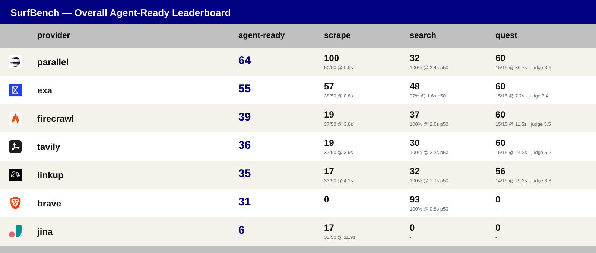

# SurfBench 🌊

**The benchmark that hires the best web assistant for your agent.**

SurfBench compares web-access APIs on the three things agents actually do: **search**, **scrape**, and **quest** (search → fetch → judge-graded answer). A Kimi K3 + GLM-5.3 judge panel grades the rides. Slow is a disqualification — the 30-second wipeout rule.


## Overall Agent-Ready Leaderboard — 4 September 2026



| provider | agent-ready | scrape | search | quest |
|---|---|---|---|---|
|  **parallel** | **64** | 50/50 @ 0.6s | 100% @ 2.4s p50 | 15/15 @ 36.7s · judge 3.6 |
|  **exa** | 55 | 38/50 @ 0.8s | 97% @ 1.6s p50 | 15/15 @ 7.7s · judge 7.4 |
|  linkup | 40 | 33/50 @ 4.1s | 61% @ 1.7s p50 | 14/15 @ 29.3s · judge 3.8 |
|  firecrawl | 39 | 37/50 @ 3.6s | 100% @ 2.0s p50 | 15/15 @ 11.5s · judge 5.5 |
|  tavily | 36 | 37/50 @ 2.9s | 100% @ 2.3s p50 | 15/15 @ 24.2s · judge 5.2 |
|  brave | 31 | – | 94% @ 0.8s p50 | – |
|  jina | 6 | 33/50 @ 11.9s | – | – |

*The two strongest providers overall: **parallel** owns pure fetching (only 100% coverage at 0.6s avg; it renders the bot-guarded pages the others fail) and **exa** owns search quality + the fastest full quest with the best judge score (7.4). Practical picks: pair an exa/brave search leg with a parallel fetch leg, or use exa when you need speed and parallel when you need coverage. Full per-event leaderboards, methodology, and judge details: [results/README.md](results/README.md).*

## Run it yourself

```bash
git clone https://github.com/riccardogiorato/surf-bench.git
cd surf-bench
bun install
cp .example.env .env   # add the provider keys you have (all key-gated)
bun run test           # all three events
bun run report         # rebuild results/summary.json + leaderboard SVG
```

Providers: firecrawl · exa · linkup · tavily · parallel · jina · brave · serper — all key-gated, absent keys skip that provider. Judge panel: Kimi K3 + GLM-5.3 via Together AI, verdicts cached by content hash. Concurrency capped per provider. License: MIT.