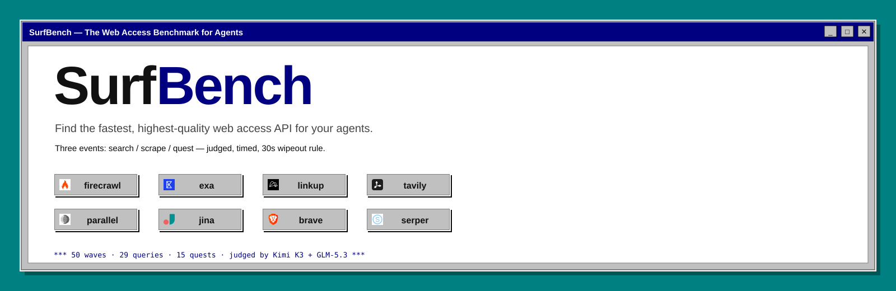

# SurfBench 🌊

**The benchmark that hires the best web assistant for your agent.**

SurfBench is an open benchmark that compares web-access APIs on the three things agents actually do: **find** (search), **read** (scrape/extract), and **do the whole job** (quest: search → fetch → graded answer). A judging panel of LLMs grades the rides. Slow is a disqualification — the 30-second wipeout rule: a provider whose search takes 10s or whose fetch takes 30s is not an assistant your agent can keep on staff.



## The Scoreboard — 4 September 2026

> Six providers ran all events; serper is implemented but key-gated (no key in `.env` yet). Times are averages/p50/p95 over successful rides only. Judge scores are the Kimi K3 + GLM-5.3 panel average, 0–10.

### Overall Agent-Ready Leaderboard

Composite across all three events: scrape score (success × speed), search score (success × speed), quest score (answered% × 60 + judge score × 4). Details in `results/overall.csv`.

| provider | agent-ready | scrape | search | quest |
|---|---|---|---|---|
|  **parallel** | **64** | 50/50 @ 0.6s | 100% @ 2.4s p50 | 15/15 @ 36.7s |
|  **exa** | 55 | 38/50 @ 0.8s | 97% @ 1.6s p50 | 15/15 @ 7.7s · judge 7.4 |
|  **firecrawl** | 40 | 37/50 @ 3.6s | 100% @ 2.0s p50 | 15/15 @ 11.5s |
|  **linkup** | 40 | 33/50 @ 4.1s | 100% @ 1.7s p50 | 14/15 @ 29.3s |
|  **tavily** | 38 | 37/50 @ 2.9s | 100% @ 2.3s p50 | 15/15 @ 24.2s |
|  **brave** | 33 | – | 100% @ 0.8s p50 | – |
|  **jina** | 6 | 33/50 @ 11.9s | – | – |

*Search-only and fetch-only providers score lower on the composite because they can't run every event — that's the point: for an agent you need both legs.*

### Scrape Event — 50 real, messy URLs (bot-prevention obstacle course)

| provider | usable success | avg usable | p50 | p95 |
|---|---|---|---|---|
|  **parallel** | **50/50** | **0.6s** | 0.5s | 0.9s |
|  exa | 38/50 | 0.8s | 0.3s | 1.4s |
|  firecrawl | 37/50 | 3.6s | 1.9s | 10.5s |
|  tavily | 37/50 | 2.9s | 0.3s | 12.2s |
|  linkup | 33/50 | 4.1s | 4.3s | 8.8s |
|  jina | 33/50 | 11.9s | 8.8s | 39.2s |

**Takeaway**: parallel is the only provider with full coverage — and it's fast. Tavily has the quickest p50 but misses the hardest pages (marketplaces, social). Jina is the slowest leg on the board.

### Search Event — 29 queries × 12 quality dims

| provider | assertions | success | p50 | p95 |
|---|---|---|---|---|
|  **exa** | **28/29** | 97% | 1.5s | 2.3s |
|  parallel | 28/29 | 100% | 2.4s | 4.4s |
|  firecrawl | 27/29 | 100% | 1.9s | 4.3s |
|  brave | 27/29 | 100% | **0.9s** | 3.2s |
|  tavily | 25/29 | 100% | 2.3s | 3.8s |
|  linkup | 20/29 | 100% | 1.7s | 2.8s |

**Takeaway**: exa leads on quality (fewest assertion failures); brave is the fastest; linkup trails badly on quality (9/29 assertion failures — entity disambiguation, factuality, safe-search). Serper is implemented but needs a key.

### Quest Event — 15 questions × (search → fetch → judge)

| provider | answered | avg total | p50 | wipeouts | judge |
|---|---|---|---|---|---|
|  **exa** | 15/15 | **7.7s** | 7.9s | 0 | pending |
|  firecrawl | 15/15 | 11.5s | 10.9s | 0 | pending |
|  linkup | 14/15 | 29.3s | 29.7s | 0 | pending |
|  tavily | 15/15 | 24.2s | 25.5s | 0 | pending |
|  parallel | 15/15 | 36.7s | 38.1s | 0 | pending |

**Takeaway**: exa is the fastest full quest (7.7s); parallel, despite the best scrape leg, is the slowest full quest (36.7s) — its search leg is the slowest too. Linkup dropped one quest.

## Suggested combos

Per-event winners paired across providers — validate these with the quest event's cross-provider mode (roadmap):

| Use case | Combo | Why |
|---|---|---|
| **Best overall agent stack** | **brave search + parallel fetch** | Brave is the fastest search (0.9s p50); parallel is the only 100% fetch coverage (50/50) at the fastest usable time (0.6s avg). |
| **Fastest single-vendor stack** | exa search + exa fetch | 1.5s search + 0.3s p50 fetch, one key, one SDK. |
| **Cheapest stack** | brave search + jina reader | free tiers on both legs (brave 2k/mo, jina free tier). |
| **Max quality gate survival** | firecrawl search + parallel fetch | firecrawl search 100% assertion pass + parallel 100% fetch coverage. |

## Why This Matters

If you are building agents that need the web, your provider choice changes everything:

- **Success rate**: can the provider actually get the page / find the thing?
- **Latency**: p50 *and* p95 — a fast p50 with a 39s p95 still stalls an agent loop.
- **Quality gate**: returning "content" isn't enough; stubs, login walls, and blocked pages fail.
- **Quest**: end-to-end find-and-read is what agents do all day — nobody else measures it.

## How Success Is Scored

A result passes only if the provider returned content that:

1. is not an error, and
2. passes `evaluateScrapedContent`: minimum length, no blocked/error-page language, and relevance to the expected page tokens.

This is stricter than "did the API return text?" — LLMs need relevant context, not just bytes.

## Methodology

- **Scrape**: 50 real URLs across jobs, real estate, social, academic, news, technical docs, marketplaces, e-commerce, local/travel.
- **Search**: 29 queries across 12 quality dimensions (factuality, recency, diversity, entity disambiguation, intent, multilingual, spam, safe-search, citation & link quality, brand homepage, latency).
- **Quest**: 15 graded questions per provider (both legs same vendor) — search → top-3 → extract → assemble; judge panel scores whether the answer is present; 30s-per-leg wipeout rule.
- **Timing**: provider-reported scrape times; search/quest timings are wall-clock; p50/p95 per provider.
- **Judges**: Kimi K3 + GLM-5.3 via Together AI — `grade(question, content) → {score 0-10, rationale}`; verdicts cached by content hash; disagreement > 2 points flagged.
- **Concurrency**: capped at 5 in-flight per provider (parallel at 4), matching earlier runs.

## Repository structure

```
src/lib/            registry, cache, concurrency, quality gate, judge, results recorder
src/suites/search/  12 quality dims × search providers
src/suites/scrape/  50-URL gauntlet × 6 fetch providers
src/suites/quest/   15 questions × both-legs providers + judging pass
scripts/report.ts   aggregates results/raw/*.jsonl → results/*.csv + summary.json + SVG
```

## Getting Started

```bash
git clone https://github.com/riccardogiorato/surf-bench.git
cd surf-bench
pnpm install
cp .example.env .env
```

Add the provider keys you want to test (all key-gated — absent keys skip that provider):

```env
FIRECRAWL_API_KEY=
EXA_API_KEY=
LINKUP_API_KEY=
TAVILY_API_KEY=
PARALLEL_API_KEY=
BRAVE_API_KEY=
JINA_API_KEY=
SERPER_API_KEY=      # optional
TOGETHER_API_KEY=    # judge panel via Together AI
```

Run the benchmark:

```bash
pnpm test      # all three events
pnpm report    # aggregate results/raw/*.jsonl → results/*.csv + summary.json
```

## Contributing

Good contributions: new providers behind the capability seam, new quest questions, new hard URLs, improved rubrics, cost tracking, cross-provider quest combos.

License: MIT